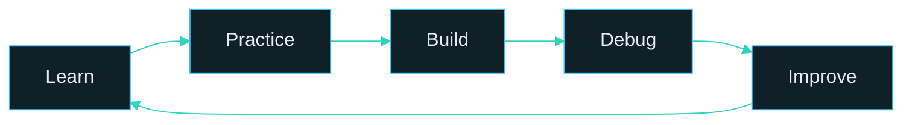

<!-- Palette: Navy #0D1117 · Deep #0F2027 · Ocean #2C5364 · Cyan #38BDF8 · Teal #2DD4BF · Indigo #818CF8 -->

 

  

 

## 👨‍💻 About Me

I'm a Computer Science Engineering student who enjoys building projects, solving programming problems, and steadily sharpening my technical skills.

| | |
|---|---|
| 🎓 **Education** | BTech in Computer Science & Engineering |
| 💼 **Interests** | Web Development · Full-Stack Development · Software Engineering |
| 🐍 **Working with** | Python, C, JavaScript |
| ⚛️ **Exploring** | React, Node.js and backend development |
| 🧠 **Practicing** | Data Structures & Algorithms |
| 🎯 **Goal** | Become a strong, production-ready software developer |

---

## 🛠️ Tech Stack

**Languages** 

**Frontend** 

**Backend & Databases** 

**Tools** 

Technologies I have worked with, explored, or am currently learning.

---

## 🚀 Featured Projects

### 🖨️ PrintX — Smart Printing Kiosk *(concept)*
A concept for an automated printing kiosk that makes printing faster and more convenient.

### 🌐 Personal Portfolio
A website showcasing my projects, skills and learning journey. **[View Portfolio →](https://github.com/kaushal-vishwakarma/My-portfolio)**

---

## 📊 GitHub Analytics

---

## 🐍 Contribution Snake

---

## 💡 Currently Learning

---

## 🎯 2026 Goals

- [ ] Strengthen Data Structures & Algorithms and problem-solving
- [ ] Build and deploy production-level full-stack applications
- [ ] Go deeper into JavaScript, React and backend development
- [ ] Contribute to open-source projects
- [ ] Prepare for software engineering placements

---

## 🔁 Development Loop

---

### Thanks for visiting. Let's build something great together. 🚀

